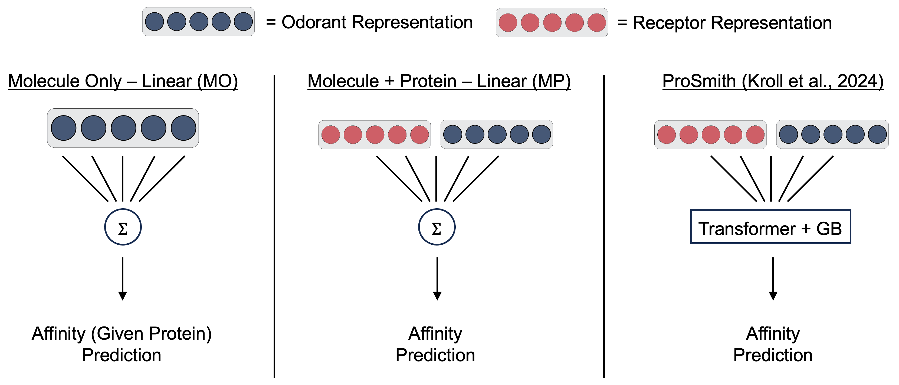

# Olfactory Foundation Models
This is a repository for the benchmarking section in [this](https://openreview.net/forum?id=BUUfUcIcfE&referrer=%5BAuthor%20Console%5D(%2Fgroup%3Fid%3DICLR.cc%2F2026%2FConference%2FAuthors%23your-submissions)) paper. The LORAX repo can be found [here](https://github.com/GrantMcConachie/olf_chemical_embs).



NOTE: MPL <-> MP and MPP <-> ProSmith are used interchangably.

## Install
### Environments
There are two separate environments to run models: one for preprocessing, MO, and MPL models and one for the MPP model.

```
conda env create -f ofm.yml  # preprocessing, MO, and MPL models
conda env create -f ofm_MPP.yml  # MPP model
```

### Datasets
The datasets used in this paper can be downloaded [here](https://zenodo.org/records/17228740).

These files also contain pre-generated embeddings, the splits used, and a pretrained MPP model. Please unzip and put the `data/` and `BindingDB/` folders in the top level directory.

## How to generate all embeddings
All embeddings are already provided in the data/ folder, but if you would like to regenerate them you can run the following command.

```
conda activate ofm
pip install -e .
python preprocess/generate_embeddings.py
```

## Running the models

### MO and MPL models
The MO and MPL models can be run with the following command.

```
conda deactivate
conda activate ofm
python model/MO/molecule_model.py # MO model
python model/MPL/combo_model.py # MPL model
```

These will plot and tabulate results in **TODO**.

### MPP model
This model is a little more nuanced to run as it is an adaptation of the ProSmith model https://github.com/AlexanderKroll/ProSmith.

First you need to run the transformer model.
```
conda activate ofm_MPP
pip install -e .
python model/MPP/training.py --train_dir data/CC/rand_splits --embed_path data/CC/embeddings/featurized_mols/MolT5.pkl --save_model_path results/CC/saved_models --binary_task False --log_name CC_MOLT5 --pretrained_model BindingDB/saved_model/pretraining_IC50_6gpus_bs144_1.5e-05_layers6.txt.pkl
```
- --train_dir - is the dataset that you want to train the model on.
- --emb_path - is the molecular embedding you want to test.
- --save_model_path - is where you would like the output of the model to save.
- --binary_task - modulates whether the model is predicting a binary task (Lalis et. al.) or not (Carey et. al.)
- --log_name - The name of a log.txt file that is generated with the training progress of the model.
- --pretrained_model - The location of a pretrained transformer that can be used in lieu of randomly initialized weights. (The model at BindingDB/saved_model/pretraining_IC50_6gpus_bs144_1.5e-05_layers6.txt.pkl is pretrained on the BindingDB dataset and is the one that the ProSmith paper uses for its' pretraining)

Once the transformer is trained, the results will populate in `results/dataset/saved_models`. There will be a folder for each split and within the split folder, there will be a folder with the molecule embedding of choice that will be populated with the transformer weights and the log.txt file.

After the transformer is trained, to train the gradient boosting part of the model, run the following command.
```
python model/MPP/training_GB.py --train_dir data/CC/rand_splits --embed_path data/CC/embeddings/featurized_mols/MolT5.pkl --num_iter 500 --log_name CC_MOLT5_GB --binary_task False
```
- --train_dir - is the dataset that you want to train the model on.
- --emb_path - is the molecular embedding you want to test.
- --num_iter - the amount of training iterations to run the gradient boosting model for.
- --log_name - The name of a log.txt file that is generated with the training progress of the model.
- --binary_task - modulates whether the model is predicting a binary task (Lalis et. al.) or not (Carey et. al.)

This will populate results in the same folder as the transformer and in the log.txt file generated from running this script, you will see the results of the trained model.
